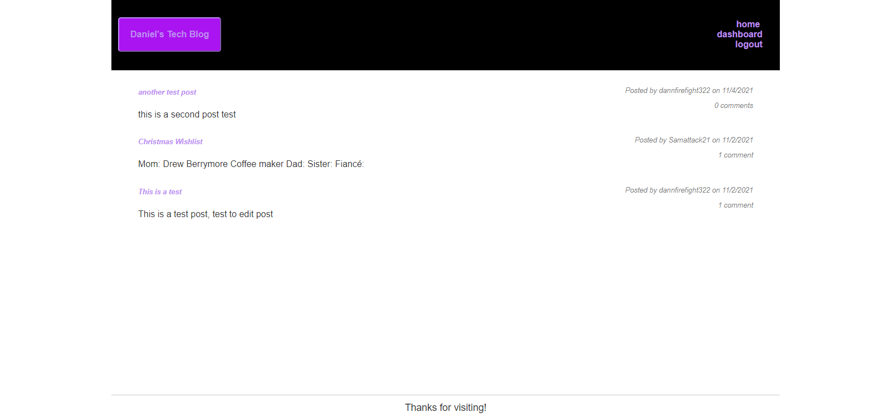

  [Deployed](https://danielstechblog.herokuapp.com/)
  
  # Title: Tech Blog
  ## Table Of  Contents
  1.[Description](#desc) 
  2.[Install Information](#install) 
  3.[Usage Information](#use) 
  4.[Contributions](#cont) 
  5.[Testing Information](#test) 
  6.[License Information](#lic) 
  7.[Questions](#ques)  
  # 
  # Description
  ### This is an blog that uses express, handlebars, and api routes so a user can log in or create an account. Once a user is logged in they can create a post, edit an existing post, delete a post, or add comments to posts of other users. This app uses a mix of html css and javascript with the help of node modules to function correctly. It is deployed to heroku and uses a database to keep track of all data that is on the application.
  # 
  # Install Information
  ### None
  # 
  # Usage Information
  ### anyone who likes to talk about and would want to with other like minded people.
  # 
  # Contribution
  ### Daniel Burford
  # 
  # Testing Information
  ### 
  # 
  # License
  ### 
  # 
  # Questions
  ### Github: https://github.com/dannfirefight322 
  ### Email: amery.bur410@gmail.com
  
  